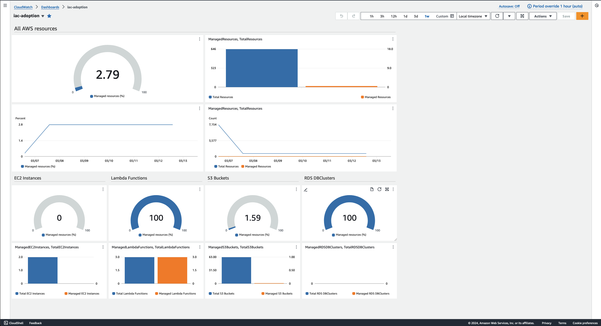
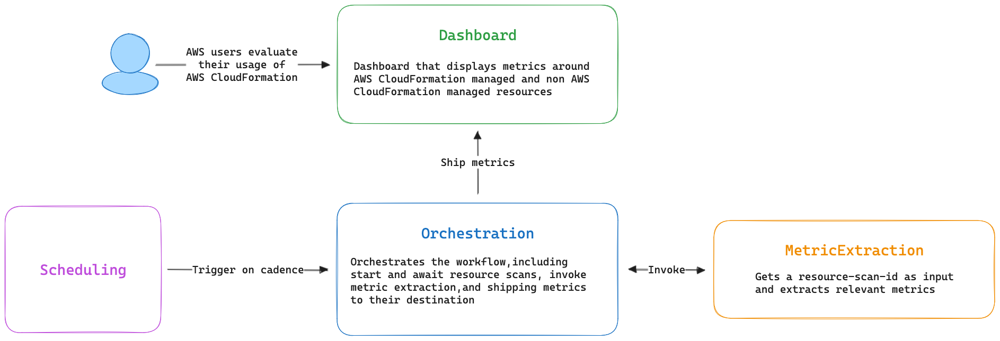
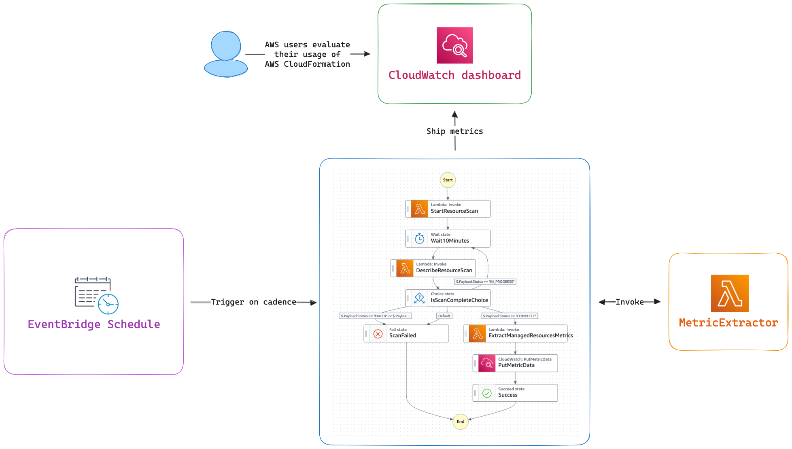

# Intro
AWS customers are adopting Infrastructure as Code (IaC) technologies. Two challenges these customers are facing are how to measure the adoption progress, and how to monitor the creation of new non-IaC resources. This application leverages [AWS CloudFormation IaC Generator](https://docs.aws.amazon.com/AWSCloudFormation/latest/UserGuide/generate-IaC.html) to monitor and identify the AWS resources that are not managed by [AWS CloudFormation](https://aws.amazon.com/cloudformation/). This helps to evaluate the progress when adopting AWS IaC technologies like AWS CloudFormation, [AWS Cloud Development Kit (CDK)](https://aws.amazon.com/cdk/), and [AWS Serverless Application Model (SAM)](https://aws.amazon.com/serverless/sam/), and plan adoption strategy in a data-driven manner.




# Overview

This solution uses the new AWS CloudFormation API calls introduced with the IaC Generator feature: [StartResourceScan](https://docs.aws.amazon.com/AWSCloudFormation/latest/APIReference/API_StartResourceScan.html), [DescribeResourceScan](https://docs.aws.amazon.com/AWSCloudFormation/latest/APIReference/API_DescribeResourceScan.html), and [ListResourceScanResources](https://docs.aws.amazon.com/AWSCloudFormation/latest/APIReference/API_ListResourceScanResources.html), to list all the IaC Generator supported resources, and to measure how many of them are managed by CloudFormation stacks. These metrics are then shipped to Amazon CloudWatch metrics as custom metrics, and displayed in an easy-to-understand Amazon CloudWatch dashboard.

This solution also supports *focused resource types* which get their own panel in the dashboard. In the image above we see `AWS::EC2::Instance`, `AWS::Lambda::Function`, `AWS::S3::Bucket`, and `AWS::RDS::DBCluster` as the focused resource types.

You can also configure *excluded resource types* the will be ignored when counting the managed resources metrics. By default the excluded resource types are `AWS::Logs::LogStream`, `AWS::Logs::LogGroup`, `AWS::IAM::ManagedPolicy`.


## Solution Architecture


- **MetricExtraction**: In charge of extracting the managed resources metrics from the output of `list-resource-scan-resources`
- **Orchestration**: Orchestrates the entire workflow, including starting and awaiting resource scans, as well as triggering metric extraction, and shipping the managed resources metrics to their destination
- **Scheduling**: Triggers the workflow orchestration on a cadence (default is daily)
- **Dashboard**: Easy-to-understand visual dashboard where users can evaluate their manage resources metrics
  
## AWS CDK Application

This AWS CDK application creates four main components
- [MetricExtraction](service/metric_extraction.py): contains the logic for extracting metrics from a resource scan
  - `ExtractMetricsLambdaFunction` Uses the `ListResourceScanResources` API call to extract managed resources metrics
- [Orchestration](service/orchestration.py): contains the orchestration for starting a resource scan, waiting for completion, metrics extraction, and metrics shipping
  - `StartScanLambdaFunction` AWS Lambda function (temporary while AWS Step Functions is missing this API call as an action)
  - `DescribeScanLambdaFunction` AWS Lambda function (temporary while AWS Step Functions is missing this API call as an action)
  - AWS Step Functions state machine that does the following:
    - Starts a resource scan
    - Awaits the resource scan to finish
    - Triggers the `ExtractMetricsLambdaFunction` AWS Lambda function
    - Ships the extracted metrics to Amazon CloudWatch metrics using the `PutMetricData` API call action
- [Scheduling](service/scheduling.py): contains the schduled rule that trigger the orchestration
  - An Amazon EventBridge scheduler that triggers the Orchestration on a cadence
- [Dashboard](service/dashboard.py): contains the creation of a dashboard from the extracted metrics
  - Amazon CloudWatch dashboard that displays the managed resources metrics in a visual manner


# Usage
## Prerequisites
### Clone This Repository
```bash
git clone git@github.com:aws-samples/monitor-iac-adoption-using-iac-generator.git
cd monitor-iac-adoption-using-iac-generator
```

### Install Dependencies
Install the AWS CDK toolkit, AWS CDK construct-library and other dependencies.
```bash
python3 -m venv .venv
source .venv/bin/activate

./scripts/install-deps.sh
```

### CDK Bootstrap
If this is the first time you use AWS CDK in this account or region you must first bootstrap it.
```bash
npx cdk bootstrap
```

## Add or Remove Focused and Excluded Resource Types
To add or remove *focused resource types* and *excluded resource types* go to [cdk_constants.py](cdk_constants.py), where you will find `RESOURCE_TYPE_FOCUS_LIST` and `RESOURCE_TYPE_EXCLUDE_LIST` which control the focused and excluded resource types respectively.

When adding *focused resource types*, make sure the new resource types are supported by IaC Generator in the [Resource type support](https://docs.aws.amazon.com/AWSCloudFormation/latest/UserGuide/resource-import-supported-resources.html) documentation.

## Deploy
Choose the AWS account and region you want to use this solution in by editing the `ENVIRONMENT` constant in [cdk_constants.py](cdk_constants.py), for more details see [Configuring environments](https://docs.aws.amazon.com/cdk/v2/guide/environments.html#environments-configure).

Deploy the AWS CDK application
```bash
npx cdk deploy IacAdoptionMonitor
```

Once the deployment finishes, you can visit your new Amazon CloudWatch dashboard [iac-adotion](https://console.aws.amazon.com/cloudwatch/home#dashboards/dashboard/iac-adoption).
Keep in mind that the dashboard will display empty metrics until the solution is triggered at least once by the scheduled rule.

## Cleanup
Clean up all the resources created by AWS CDK
```bash
npx cdk destroy "**" -f
```


# Cost Analysis

AWS offers free tier for many services. In this cost analysis we will ignore the free tier and estimate the pricing of the used services based on their highest rate. Also, please keep in mind that this is an estimation, and there might be some minor additional costs.

For this analysis we will use the following scenario 
* Total of 10,000 resources in the AWS account and region this solution is deployed in
* Four *focused resource types*

Since a resource scan can take up to 10 minutes for 1,000 resources, we will estimate that the await loop in the state machine has 10 iterations.

## Overall cost
In the scenario above, the total cost for this solution would be **~$6.0 per month**.

## Cost Breakdown
* AWS Lambda
  * Three functions, each with 128 MB of memory
    * StartResourceScan (temporary): ~1 second execution time
    * DescriveResourceScan (temporary): ~1 second execution time * 10 invocations
    * Metric extractor ~40 seconds execution time
    * Overall monthly execution time = 30 days * ~50 seconds per day = ~1500 seconds per month
  * Cost
    * 1500 seconds * 0.128 GB = 192 GB-second per month
    * $0.0000166667 * 192 GB-second = $0.00320001 per month
* AWS Step Functions state machine
  * One standard state machine with eight states
    * 35 state transitions per state machine invocation
    * 30 days * 35 state transitions = ~1000 state transitions per month 
  * Cost
    * $0.025 per month
* Amazon EventBridge scheduler
  * One scheduler configured with daily invocation
  * Cost 
    * Since the pricing is $1.00/million scheduled invocations per month the cost is insignificant
* Amazon CloudWatch
  * Custom metrics
    * Two for the general count of managed and non-managed resources
    * Two for each *focused resource type*
    * Cost
      * Overall 10 custom metrics
      * 10 custom metrics * $0.30 = $3.00 per month
  * Dashboard
    * One dashboard
    * API calls
      * Since the pricing is $0.01 per 1,000 requests the cost is insignificant
    * Cost
      * $3.00 per month


# Security

See [CONTRIBUTING](CONTRIBUTING.md#security-issue-notifications) for more information.

# License

This library is licensed under the MIT-0 License. See the LICENSE file.
